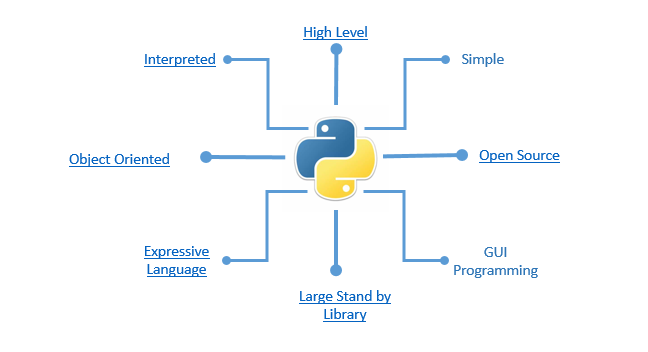
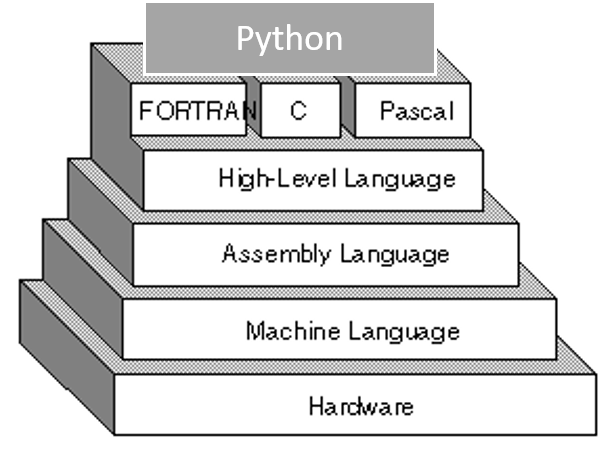

# Introduction

-   Programming is way to "instruct the computer to perform various tasks".

-   Just like we use Urdu or English to communicate with each other , we use a programming language like, C, C++, R or Python to communicate with computer.

-   Implies, a program is specific set of *ordered operations/instruction* for a computer to perform

## Python

Python is a widely used general-purpose, high level **programming** language. It was created by *Guido van Rossum* in 1991 and further developed by the Python Software Foundation. It was designed with an emphasis on code readability, and its syntax allows programmers to express their concepts in fewer lines of code.

{width="50%"}

-   It is an interpreted, interactive, object-oriented programming language. It incorporates modules, exceptions, dynamic typing, very high level dynamic data types, and classes.

-   It's easy and simple to understand language which feels like reading simple English. This pseudo code nature of Python makes it easy to learn and understand for beginners. Python is a programming language that lets you work quickly and integrate systems more efficiently.

## Features of Python

### High Level Programming

-   A high-level language (**HLL**) is a programming language such as C, FORTRAN, or Pascal that enables a programmer to write programs that are more or less independent of a particular type of computer. Such languages are considered high-level because they are closer to human languages and further from machine languages.

-   In contrast, assembly languages are considered low-level because they are very close to machine languages.

{width="50%"}

### Interpreted Vs Compiled

-   Every program is a set of instructions, whether it's to add two numbers or send a request over the internet. **Compilers and interpreters** take human readable code and convert it to computer readable machine code.

-   In a ***compiled language***, the target machine directly translates the program. In an interpreted language, the source code is not directly translated by the target machine. Instead, a *different* program, aka the interpreter, reads and executes the code.

### Object Oriented Programming

\- There are many \*\*object-oriented\*\* programming languages including \*\*JavaScript, C++, Java, and Python\*\*. These functions are defined within the class and perform some actions helpful to that specific type of object.

{width="100%"}

### Expressive

**Expressive** means that it's easy to write code that's easy to understand, both for the compiler and for a human reader.

Two factors that make for expressiveness:

-   Intuitively readable constructs

-   Lack of boilerplate code

Example: Expressive Python Vs less Expressive Java equivalent.

{width="100%"}

## General Errors and Debugging

-   Programming is a complex process, and because it is done by human beings, it often leads to errors. Programming errors are called bugs and the process of tracking them down and correcting them is called debugging.

-   **Syntax Errors**: Syntax refers to the structure of a program and the rules about that structure.

    -   Python is not so forgiving. If there is a single syntax error anywhere in your program, Python will display an error message and quit, and you will not be able to run your program. During the first few weeks of your programming career, you will probably spend a lot of time tracking down syntax errors. As you gain experience, though, you will make fewer errors and find them faster.

-   **Run-time Errors**: Run-time refers to an error that takes place while executing a program.

    As opposed to the compilation errors that occur during a program compilation, runtime errors occur only during the execution of the program. For example, insufficient memory can often trigger a run-time error. [The Code that exploded a rocket](https://www.youtube.com/watch?v=5tJPXYA0Nec "The Code that exploded a rocket")

-   **Semantic Errors**: If there is a semantic error in a program, it will run successfully, in the sense that the computer will not generate any error messages, but it will not do the right thing. It will do something else. Specifically, it will do what you told it to do.

    -   The problem is that the program you wrote is not the program you wanted to write. The meaning of the program (its semantics) is wrong. Identifying semantic errors can be **tricky** because it requires you to work backward by looking at the output of the program and trying to figure out what it is doing.

-   **Experimental Debugging:** One of the most important skills you will acquire is debugging. Although it can be frustrating, debugging is one of the most **intellectually rich**, **challenging**, and **interesting** parts of programming.

-   In some ways, debugging is like **detective work**. You are confronted with clues, and you have to infer the processes and events that led to the results you see. Its an **Iterative Process.**

## Installing Python

You may download and install [Python](https://www.python.org/downloads/) from here.
